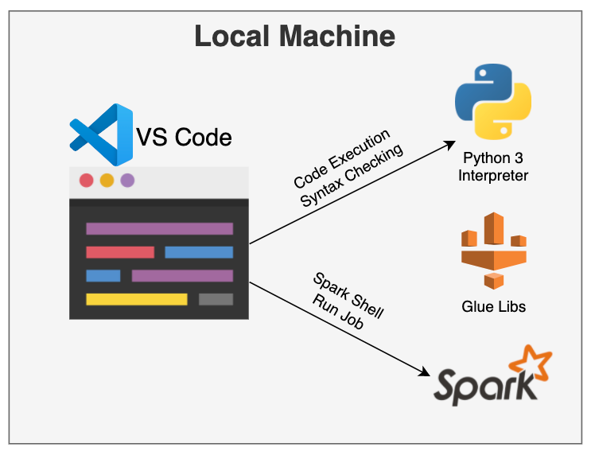
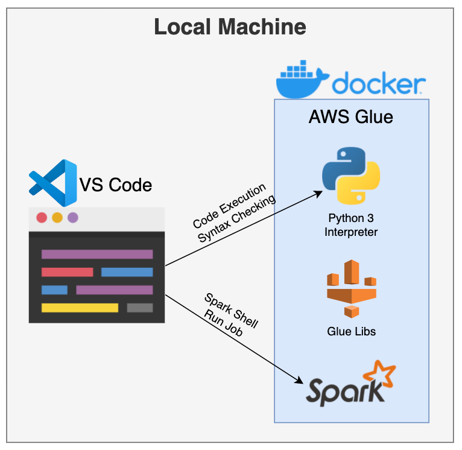
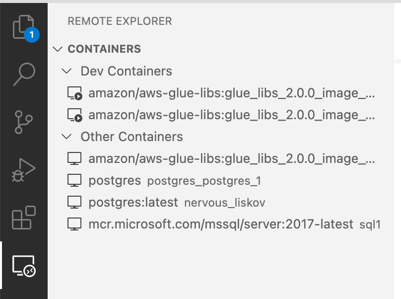

# Test-Driven Data Engineering with Python, PySpark, and AWS Glue
This repo contains code that can be used to get started with test-driven data engineeringn with Python-based technologies. The code specifically targets Python, PySpark, and AWS Glue.

## Helpful Resources
Here are some helpful resources that are worth perusing.
* [Blog on developing Glue jobs locally](https://aws.amazon.com/blogs/big-data/developing-aws-glue-etl-jobs-locally-using-a-container/). Keep in mind it's a bit out of date, but has good material once the container is running.
* [Another blog on building AWS Glue ETL without an account](https://aws.amazon.com/blogs/big-data/building-an-aws-glue-etl-pipeline-locally-without-an-aws-account/)
* One [blog on remote containers with VS Code](https://cevo.com.au/post/aws-glue-local-development/)
* [Remote python with VS Code](https://devblogs.microsoft.com/python/remote-python-development-in-visual-studio-code/)

## Machine Setup
The following tools and extensions are needed for this setup (these are the versions used for this demo):

* Docker Engine (20.10.12)
* VS Code (1.65.2)
  * Extension: Python
  * Extension: Docker
  * Extension: Remote - Containers

### Why VS Code?
Though I prefer Jet Brains products, you had to pay for a professional license to get docker container support. It's free with VS Code, and I was interested in learning the IDE.

### Why Docker?
Python virtual environments are really nice for create separate interperter, library, and development environments. They are easy to set up with a `requirements.txt` file, but sometimes machines get cluttered and end up with issues, such as:  
 * Possible need to manage multiple spark environments
 * Need to manage multiple python environments
 * Need to manage multiple Glue library configurations
 * Windows adds a whole new dynamic of issues with Spark development

Though these can be managed, with good care, it doesn't take much to end up with an environment that has conflicting libraries or classpath dependencies.

The setup for this demo uses Docker because it allows for a controlled use of Docker, set up by AWS, so that it can better represent the AWS environment. This is precisely what Docker is for, and can be a much easier replacement than managing all the tool dependencies on your local machine.

The images below show the difference between the local vs. Docker approach.

|Depiction of Connectivity|Description/Notes|
|:---:|---|
||Local Library Installation<br><ul><li>Requires local installation of libraries that match destination environment.</li><li>Can use virtual environments to isolate python libraries.</li><li>Spark installations could interfere with each other.</li><li>AWS Glue python libraries may have conflicts.</li><li>Have to manage multiple core python/spark installations if you work on many different projects.</li><li>VS Code also needs to be configured to work with proper library combinations.</li></ul>|
||Use Python in Docker<ul><li>Libraries are all installed in the docker container to represent deployment environment.</li><li>AWS Manages the Spark, Glue, and Python installation.</li><li>VS Code connects to the container through the `Remote - Containers` plugin.</li><li>Allows for having different containers for different Glue deployments.</li></ul>

## Run the AWS Glue Docker Container
The AWS Glue docker container is great, if you get it to work. Getting it to run isn't as simple a task as you'd expect. Once it's running, Spark doesn't actually work properly either. This section will help get through all that.

Steps:
1. Get container running
2. Clean up the classpath conflicts

Docker Container Used: `amazon/aws-glue-libs:glue_libs_2.0.0_image_01`

**STEP 1: Get Container Running From Command Line:**
Notice in the command below the two `--volume` arguments. The `.aws` one is optional, but is a precursor to doing other things with AWS tooling/CLI. The `python` folder contains the code to run and is mounted as `demo_code`.

***NOTE:** The `PATH` environment variable is modified here from the default because the $SPARK_HOME/bin needs to be added so the user can use `spark-shell` and `pyspark` shell.*

```bash
docker run \
  --name "/glue_cmd" \
  --runtime "runc" \
  --volume "/Users/donaldsawyer/.aws:/home/glue_user/.aws" \
  --volume "/Users/donaldsawyer/git/tdde-py-pyspark:/home/glue_user/demo_code" \
  --log-driver "json-file" \
  --restart "" \
  --network "bridge" \
  --expose "18080/tcp" \
  --expose "4040/tcp" \
  --expose "8080/tcp" \
  --expose "8443/tcp" \
  --expose "8888/tcp" \
  --expose "8998/tcp" \
  --env "LANG=en_US.UTF-8" \
  --env "PYSPARK_PYTHON=python3" \
  --env "SPARK_HOME=/home/glue_user/spark" \
  --env "ZEPPELIN_ADDR=0.0.0.0" \
  --env "SPARK_CONF_DIR=/home/glue_user/spark/conf" \
  --env "PYTHONPATH=/home/glue_user/aws-glue-libs/PyGlue.zip:/home/glue_user/spark/python/lib/py4j-0.10.7-src.zip:/home/glue_user/spark/python/" \
  --env "PYSPARK_PYTHON_DRIVER=python3" \
  --env "HADOOP_CONF_DIR=/home/glue_user/spark/conf" \
  --env "PATH=/usr/local/sbin:/usr/local/bin:/usr/sbin:/usr/bin:/sbin:/bin:/home/glue_user/spark/bin" \
  --label "AUTHOR"="Subramanya Vajiraya (subvj@), Vishal Pathak (pathavis@)" \
  --label "maintainer"="AWS Glue Team" \
  --label "version"="2.0" \
  --attach stdout \
  --attach stderr \
  --tty \
  "amazon/aws-glue-libs:glue_libs_2.0.0_image_01"
  ```

**STEP 2: Clean Up the Spark Classpath:**  
There are conflicts on the Spark classpath within the container. Clean up the conflicting jars that are available from the AWS Glue folder.

Run `rm ~/aws-glue-libs/jars/netty-*.jar` to clear out the aws conflicting jars.  *NOTE: this is worrisome because it's not clear if those are needed in AWS Glue, thus defeating the purpose of using a Docker container.*

## Connect VS Code to the Docker Container
Using the `Remote - Containers` extension, you can connect to a docker image. On the left pain of VS Code, this can be found in the **Remote Explorer** tab. You will see running containers, where you can choose your container.



With the new connected window that is opened up, you can do development and run code from within the IDE.